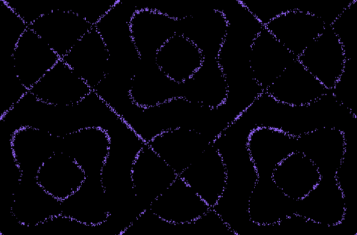

# Chladni plate

See live demo [here](https://luciopaiva.com/chladni).

When resonating, a vibrating plate is divided into regions that oscillate in opposite directions, bounded by lines where no vibration occurs. The resulting patterns are what is called [Chladni figures](https://en.wikipedia.org/wiki/Ernst_Chladni#Chladni_figures). This simulation aims at replicating that same behavior on a digital canvas.

One of the key factors causing the patterns is the shape of the plate being vibrated. For this simulation, a square plate is assumed. The function that describes patterns in a square plate of side length `L` is given by:

    cos(n * π * x / L) cos(m * π * y / L) - cos(m * π * x / L) cos(n * π * y / L)

Where `x, y` is the screen coordinate to compute and picking different `m` and `n` values produces different patterns (with the exception of `m == n`, where no pattern emerges).

## Implementation details

My idea was to cycle through random Chladni patterns, as if the plate's vibration input frequency was changing periodically.

To make it easy for the CPU, I compute the whole Chladni pattern only once and then just simulate particles shaking and moving around until the next cycle.

Not only I had to compute the pattern, I also had to compute a gradient field so that particles could look up quickly where to go considering where they are right now. This turned to be even more expensive, due to each position having to check its 8 neighbors to know where to point its gradient to.

Computing a single Chladni pattern plus gradients is very expensive, taking around 100ms on a `Intel® Core™ i5-4670 CPU @ 3.40GHz × 4` for about 500k points (canvas scale factor at 2, i.e., a quarter of a full HD screen). Since this would kill the frame rate, I used a web worker for the task. Every x seconds it selects a new pattern, computes it and posts a message to the main thread with the new buffer. The worker *transfers* its buffer, meaning there is no copy involved.

## References

[Paul Bourke](https://twitter.com/pauldavidbourke)'s [article on Chladni plates](http://paulbourke.net/geometry/chladni/) was extremely helpful.
